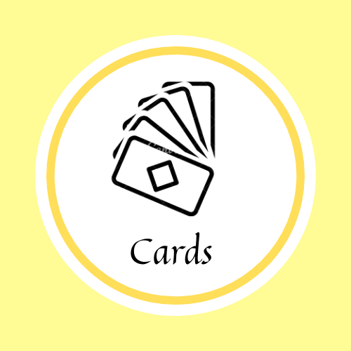
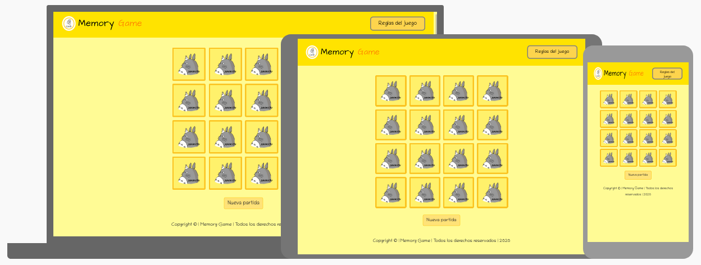

<p align="center"><a href="public/logo.png"></a></p>
<h1 align="center">Memory Game</h1>

Juego de memoria de cartas.

## Acerca del juego

- Un jugador.
- 16 cartas, 8 pares idénticos.
- Las cartas cargan aleatoriamente en cada partida. 
- La temática usada son las películas del [Studio Ghibli](https://es.wikipedia.org/wiki/Studio_Ghibli).
- El objetivo del juego es encontrar pares idénticos.

## Instrucciones del juego

#### Desarrollo del juego:
- Seleccione dos cartas. 
- Si las dos cartas son pares, éstas desaparecerán en su mismo sitio sin moverse las demás. 
- Solo son pares las cartas que son idénticas.

#### Fin del juego:
- Cuando ya no haya más cartas, se sobreentenderá que logró hallar todos los pares idénticos. 
- Por lo tanto, el juego se dará por terminado.

## Demos





## Sobre el proyecto

- Implementado en `React`.
- Otras tecnologías: `Js`, `Node.js`, `Jest`, `Bootstrap`, `Sass`, `Css` y `Html`.
- Pruebas unitarias con coverage al 100%.
- Desplegado en `gh-pages`.

## Boilerplate del proyecto
El _boilerplate_ contiene la siguiente estructura de archivos:

```text
.
├── public
|  ├── index.html
|  ├── logo.png
|  ├── site.webmanifest
├── src
|  ├── components
|  |  ├── Footer.jsx
|  |  ├── GameCards.jsx
|  |  ├── GameRules.jsx
|  |  ├── Header.jsx
|  |  ├── ItemCard.jsx
|  |  ├── ModalGame.jsx
|  |  └── PageError.jsx
|  ├── css
|  ├── data
|  |    └── cards.js
|  ├── img
|  └── sass
|       ├── styles.scss
|       └── ...
├── index.jsx
├── Router.jsx
├── test
|  ├── data.spec.js
├── .gitignore
├── package.json
└── README.md

directory: 8 Components: 7
```

## Licencia

Copyleft 🄯 2020, Licencia BSD-3-Clause.
